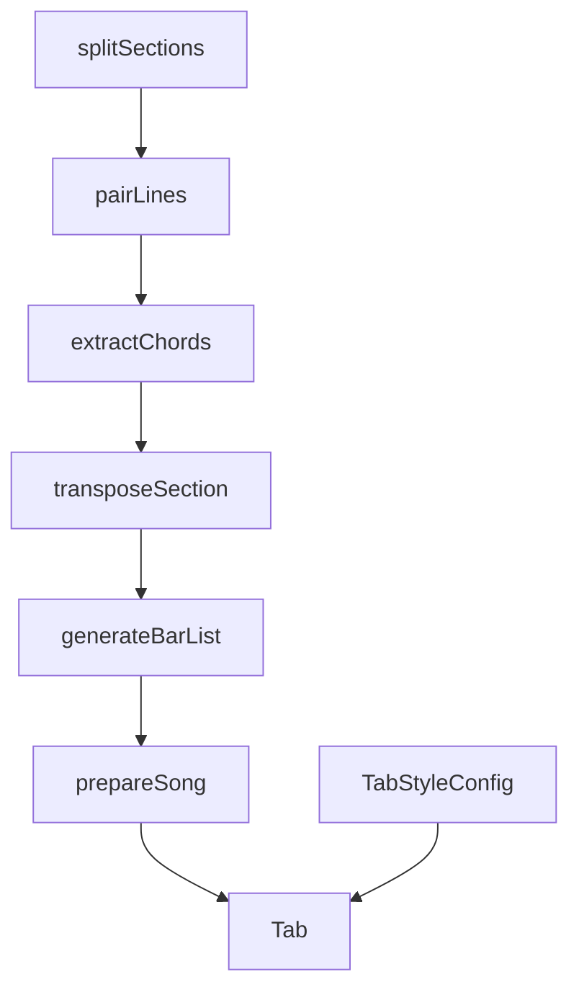

# Styled Viewer Pipeline and Styling Stories

> **Status: completed (v0.2.0, 2026-05-24).** Validation: `npm run lint && npm test && npm run build && npm run build-storybook` — all passing.

**Goal:** Implement the interleaved chord pipeline, public `TabStyleConfig`, Achordex-style CSS rendering, and Storybook `07 Styling` per [PRD 0002](../prd/0002-styled-viewer-pipeline.md) and [RFC 0002](../rfc/0002-interleaved-bars-and-tab-style-config.md).

**Architecture:** Headless `prepareSong()` owns sections → pair → extract → transpose → `generateBarList`. `Tab` is the styled viewer only. `transform()` + primitives support Storybook `01`–`05` and custom composition (`Tab.Root` + `Tab.Section`).

**Tech stack:** TypeScript, Vitest, React 19, Storybook 10, `@tonaljs/tonal` (new core dependency)

**Reference repo:** `/home/saito/_git/achordex/lib/tab/` and `components/tab/Tab.tsx`

---

## Phase 0 — Documentation (this delivery)

- [x] PRD 0002
- [x] RFC 0002
- [x] This plan
- [x] Update `docs/README.md` index
- [x] Add note in PRD 0001 pointing to 0002
- [x] Update root `README.md` documentation links

---

## Phase 1 — Core types and splitSections

**Files:**

- Create: `src/core/parser/splitSections.ts`
- Create: `src/core/parser/types.ts`
- Create: `src/core/__tests__/splitSections.test.ts`
- Modify: `src/core/index.ts`

- [x] **Step 1:** Write failing test — `[Verse]\nC\nLine` → two sections with titles
- [x] **Step 2:** Implement `splitSections(body: string): SectionText[]`
- [x] **Step 3:** Export types `SectionText` from core

**Validate:** `npm test -- splitSections`

---

## Phase 2 — Pairer

**Files:**

- Create: `src/core/parser/pairer/pairLines.ts`
- Create: `src/core/parser/pairer/index.ts`
- Create: `src/core/__tests__/pairer.test.ts`
- Port logic from: `achordex/lib/tab/parser/pairer/`

- [x] **Step 1:** Test chord line + lyric line → single `BarLine` with both bars
- [x] **Step 2:** Test chord-only section (empty lyric bar)
- [x] **Step 3:** Test lyric-only line (no chordsList)

**Validate:** `npm test -- pairer`

---

## Phase 3 — Chord extractor

**Files:**

- Create: `src/core/parser/extractor/parseChord.ts`
- Create: `src/core/parser/extractor/addChordsToSections.ts`
- Create: `src/core/__tests__/extractor.test.ts`

- [x] **Step 1:** Test `C`, `Am7`, `B7(13-)`, `D7/9` parse to structured chord + position list
- [x] **Step 2:** Test `addChordsToSections` attaches `chordsList` to bar lines

**Validate:** `npm test -- extractor`

---

## Phase 4 — Transposer

**Files:**

- Create: `src/core/transposer/chordToText.ts`
- Create: `src/core/transposer/transposeSection.ts`
- Create: `src/core/__tests__/transposer.test.ts`
- Modify: `package.json` — add `@tonaljs/tonal`

- [x] **Step 1:** Test `transpose_number: 2` changes `C` → `D` in section output
- [x] **Step 2:** Test `transpose_number: 0` is identity
- [x] **Step 3:** Implement `chordToText` for render display

**Validate:** `npm test -- transposer`

---

## Phase 5 — generateBarList (interleaved segments)

**Files:**

- Create: `src/core/renderer/generateBarList.ts`
- Create: `src/core/__tests__/generateBarList.test.ts`
- Port from: `achordex/lib/tab/renderer/propsGenerator.ts`

- [x] **Step 1:** Test interleaves lyric + chord for `C   G` / `Letra`
- [x] **Step 2:** Test `isNoLyricsLine` when lyric bar empty
- [x] **Step 3:** Test `viewMode: "o"` uses `\n` separator vs `"e"` uses `". . "`

**Validate:** `npm test -- generateBarList`

---

## Phase 6 — prepareSong orchestrator

**Files:**

- Create: `src/core/prepareSong.ts`
- Create: `src/core/__tests__/prepareSong.test.ts`
- Modify: `src/core/types.ts` — `PreparedSong`, `BarSegment`, `PrepareSongOptions`
- Modify: `src/core/index.ts`

- [x] **Step 1:** Integration test with `tua-flor.txt` fixture — `sections.length > 0`, has chord segments
- [x] **Step 2:** Implement `prepareSong({ body, transposeNumber, viewMode, beat })`
- [x] **Step 3:** Export `DEFAULT_TAB_STYLE` constants (from PRD defaults)

**Validate:** `npm test -- prepareSong`

---

## Phase 7 — React styled rendering

**Files:**

- Create: `src/react/styled/TabStyledContainer.tsx`
- Create: `src/react/styled/TabStyledSection.tsx`
- Create: `src/react/styled/buildTabNodes.tsx`
- Create: `src/react/styled/chordSpanStyle.ts`
- Create: `src/react/styled/defaultTabStyle.ts`
- Modify: `src/react/types.ts` — `TabStyleConfig`, update `TabProps`
- Modify: `src/react/Tab.tsx` — dual memo, call `prepareSong`
- Create: `src/react/__tests__/Tab.styled.test.tsx`

- [x] **Step 1:** Test `displayMode: "chords"` — no lyric text in output
- [x] **Step 2:** Test `displayMode: "lyrics"` — no chord text in output
- [x] **Step 3:** Test chord span has `bottom` and negative `marginRight` from style config
- [x] **Step 4:** Test `contentMarginRightPx` on container
- [x] **Step 5:** Wire `Tab` to merge `Partial<TabStyleConfig>`

**Validate:** `npm test -- Tab.styled`

---

## Phase 8 — Storybook `07 Styling`

**Files:**

- Create: `src/react/stories/07-styling/08-full-config.stories.tsx` — single story, all `TabStyleConfig` controls
- Create: `src/react/stories/07-styling/styling-argtypes.ts`, `styling-meta.ts`
- Modify: `src/react/AGENTS.md`, `.storybook/preview.tsx` (Theme toolbar)

- [x] **Step 1:** Shared `meta` helper with flat style args
- [x] **Step 2:** Full-config story on `tuaFlorBody`
- [x] **Step 3:** Light/dark readable preview frames (`stories.css`)

**Validate:** `npm run storybook` (manual) + `npm run build-storybook`

---

## Phase 9 — Package surface and docs sync

**Files:**

- Modify: `README.md` — document `prepareSong`, `TabStyleConfig`, link PRD/RFC 0002
- Modify: `docs/prd/0001-tab-renderer-library.md` — supersession note
- Modify: `src/react/index.ts` — export `TabStyleConfig`, `DEFAULT_TAB_STYLE`
- Modify: `CHANGELOG.md`

- [x] **Step 1:** Bump minor version when releasing (0.2.0)
- [x] **Step 2:** Ensure `npm run build` emits types for new exports

**Validate:** `npm run lint && npm test && npm run build && npm run build-storybook`

---

## Dependency graph

---

## Testing matrix

| Layer      | Command                                   | Covers                  |
| ---------- | ----------------------------------------- | ----------------------- |
| Parser     | `npm test -- parser`                      | sections, pair, extract |
| Transposer | `npm test -- transposer`                  | semitones               |
| Renderer   | `npm test -- generateBarList prepareSong` | interleave, viewMode    |
| React      | `npm test -- Tab`                         | displayMode, styles     |
| Storybook  | `npm run build-storybook`                 | controls build          |

---

## Out of scope (do not implement in this plan)

- `scrollSpeed` / auto-scroll viewer
- Dial panel UI or nuqs query state
- Convex / user settings persistence
- Migrating Achordex app to consume package (separate project)

---

## Rollback / compatibility

- `transform()` and composable primitives remain for custom UI; `Tab` does not expose a legacy wrapper.
- Stories `01`–`06` use the full `tua-flor` fixture via `story-tua-flor.ts`.

---

## Related Documents

- [PRD 0002](../prd/0002-styled-viewer-pipeline.md)
- [RFC 0002](../rfc/0002-interleaved-bars-and-tab-style-config.md)
